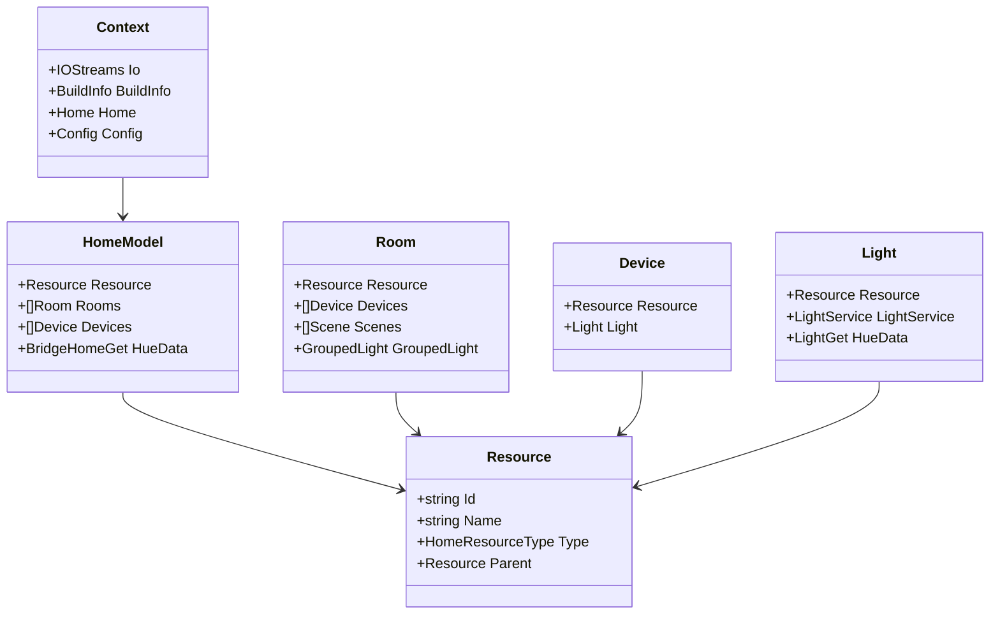
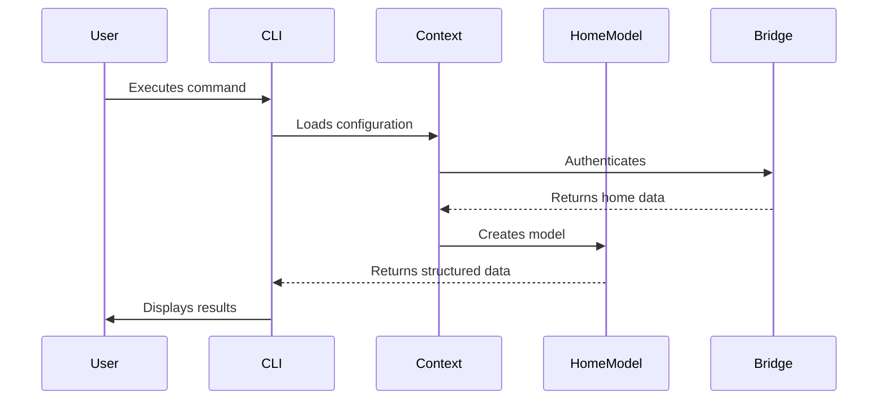
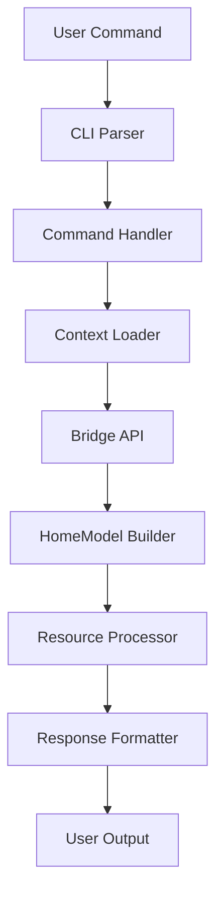
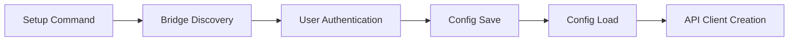
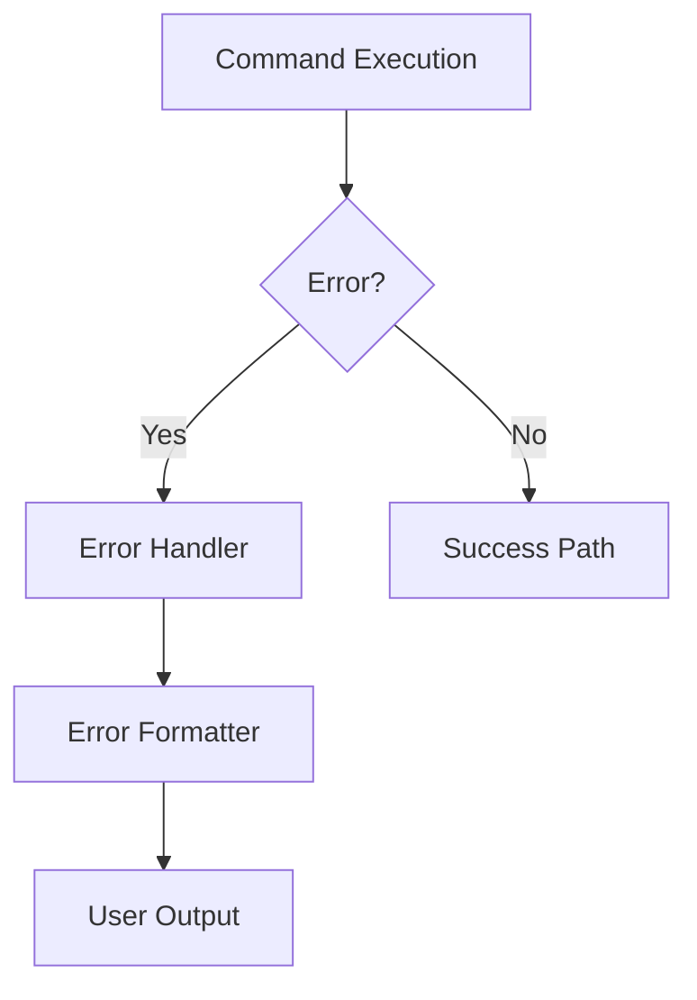
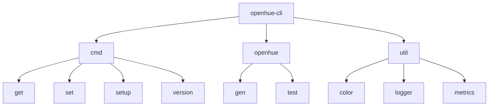
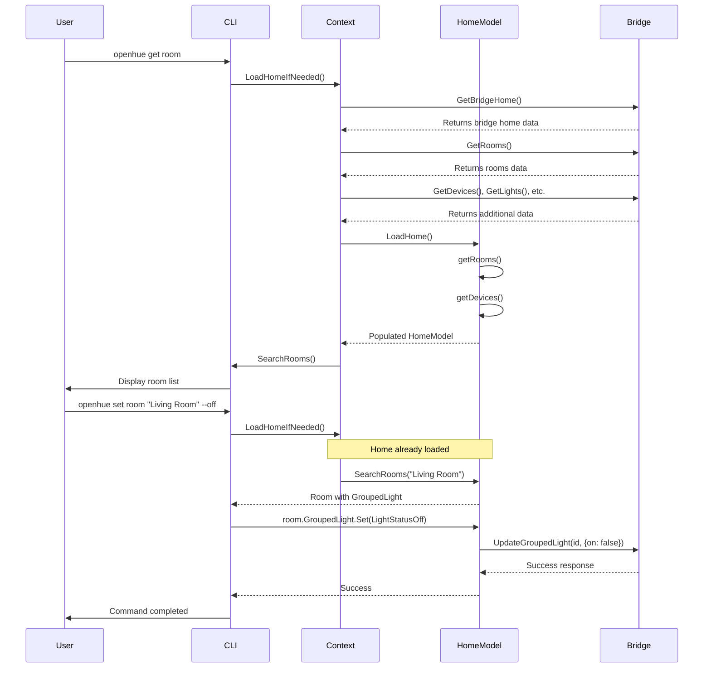
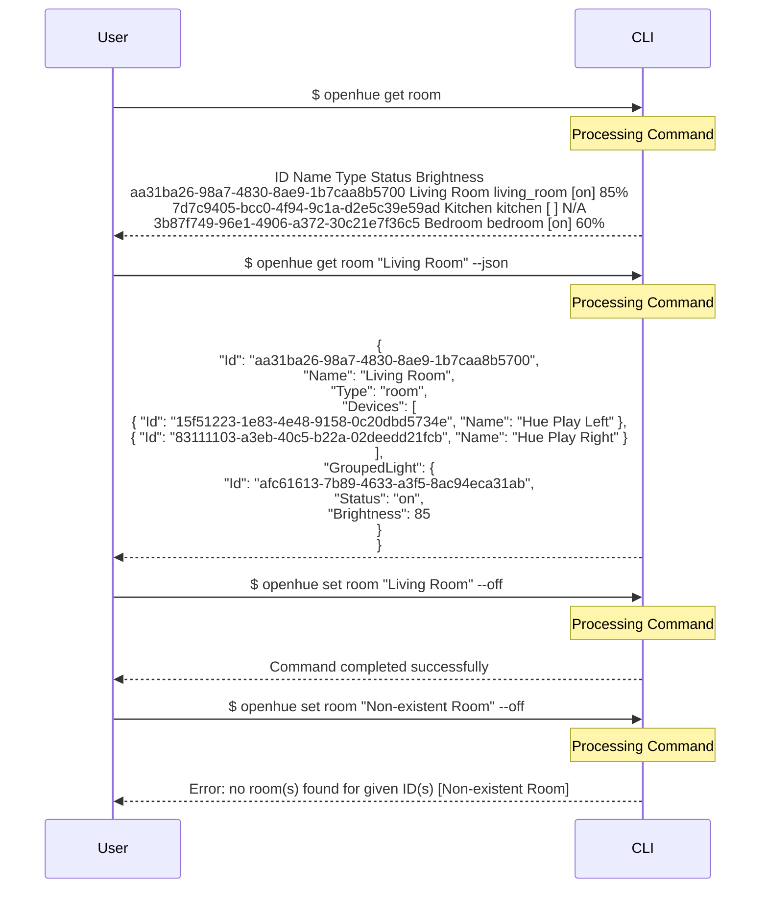

# OpenHue CLI Architecture Diagrams

## Core Components UML

## Command Flow

## Data Flow

## Configuration Flow

## Error Handling Flow

## Project Structure

## Room Discovery and Light Control Flow

## CLI Interface Examples

