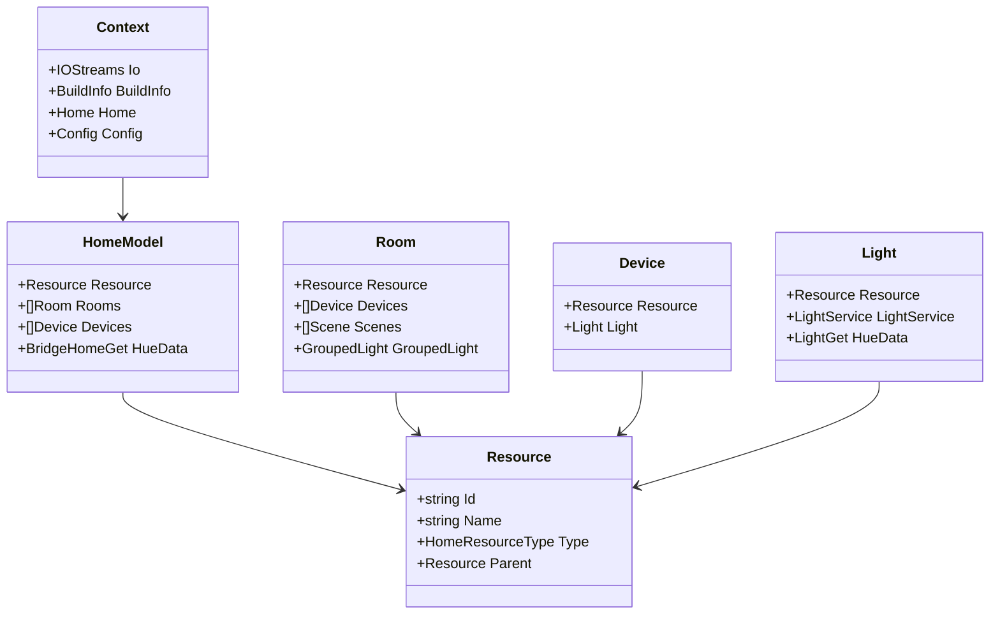
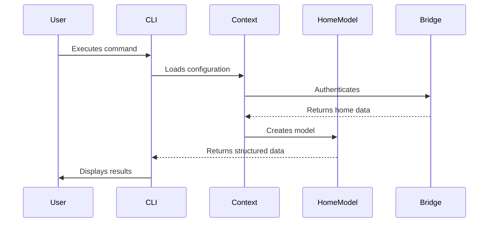
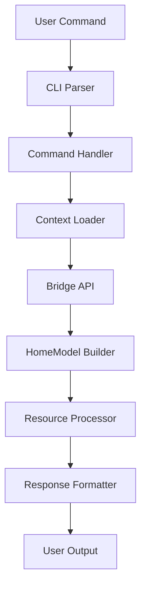
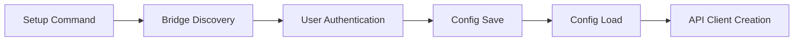
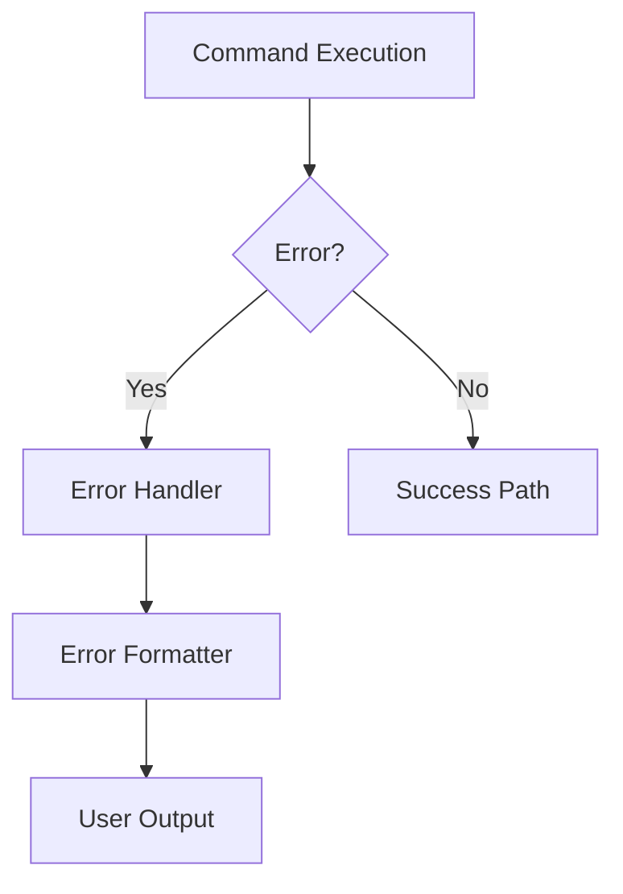
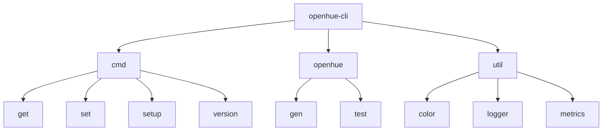

# OpenHue CLI Architecture Diagrams

## Core Components UML

```mermaid
classDiagram
    class Context {
        +IOStreams Io
        +BuildInfo BuildInfo
        +Home Home
        +Config Config
    }
    
    class HomeModel {
        +Resource Resource
        +[]Room Rooms
        +[]Device Devices
        +BridgeHomeGet HueData
    }
    
    class Resource {
        +string Id
        +string Name
        +HomeResourceType Type
        +Resource Parent
    }
    
    class Room {
        +Resource Resource
        +[]Device Devices
        +[]Scene Scenes
        +GroupedLight GroupedLight
    }
    
    class Device {
        +Resource Resource
        +Light Light
    }
    
    class Light {
        +Resource Resource
        +LightService LightService
        +LightGet HueData
    }
    
    Context --> HomeModel
    HomeModel --> Resource
    Room --> Resource
    Device --> Resource
    Light --> Resource
```

## Command Flow

```mermaid
sequenceDiagram
    participant User
    participant CLI
    participant Context
    participant HomeModel
    participant Bridge
    
    User->>CLI: Executes command
    CLI->>Context: Loads configuration
    Context->>Bridge: Authenticates
    Bridge-->>Context: Returns home data
    Context->>HomeModel: Creates model
    HomeModel-->>CLI: Returns structured data
    CLI->>User: Displays results
```

## Data Flow

```mermaid
graph TD
    A[User Command] --> B[CLI Parser]
    B --> C[Command Handler]
    C --> D[Context Loader]
    D --> E[Bridge API]
    E --> F[HomeModel Builder]
    F --> G[Resource Processor]
    G --> H[Response Formatter]
    H --> I[User Output]
```

## Configuration Flow

```mermaid
graph LR
    A[Setup Command] --> B[Bridge Discovery]
    B --> C[User Authentication]
    C --> D[Config Save]
    D --> E[Config Load]
    E --> F[API Client Creation]
```

## Error Handling Flow

```mermaid
graph TD
    A[Command Execution] --> B{Error?}
    B -->|Yes| C[Error Handler]
    B -->|No| D[Success Path]
    C --> E[Error Formatter]
    E --> F[User Output]
```

## Project Structure

```mermaid
graph TD
    A[openhue-cli] --> B[cmd]
    A --> C[openhue]
    A --> D[util]
    
    B --> B1[get]
    B --> B2[set]
    B --> B3[setup]
    B --> B4[version]
    
    C --> C1[gen]
    C --> C2[test]
    
    D --> D1[color]
    D --> D2[logger]
    D --> D3[metrics]
``` 